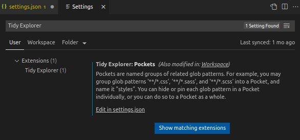

# Tidy Explorer

Tidy up your file explorer, hide or pin files and folders with just one click.

This extension allows you to configure glob patterns and group related glob patterns into "Pockets". Then you can toggle the files that match an individual pattern or all patterns in a Pocket to:

- hide the files in the file Explorer (one-click adding into the "files.exclude" setting)
- pin the files in the "Tidy Explorer"

When you have a complex project with a large number of files and folders, this extension help you reduce the distractions from uninterested files (e.g. auto-generated) and focus on the files you are working on.

## Support

If you like this extension, please consider buying me a coffee :)

https://www.buymeacoffee.com/bingtimren

## Define Pockets

To get started, first configure Pockets:

1. Open settings by following menu command **"File->Preference->Settings"**, or from the Command Palette (Ctrl+Shift+P) with **"Preferences: Open Settings"**
2. Find "Tidy Explorer" settings by inputting "Tidy Explorer" in "Search settings", or under "Extensions".

    
3. Select a scope to define the Pockets. You can define Pockets in the User scope, Workspace scope, or a workspace folder. Then click "Edit in settings.json".
4.  Define Pockets, each Pocket has a name and a group of selectors (glob patterns)

    
5. Save the settings

## Use the Switch Board

After the Pockets and the glob patterns are defined, you can toggle them in the Switch Board. 

The Switch Board organizes Pockets and glob patterns in a tree, under the setting scopes (User settings, Workspace settings, or a workspace folder) in which they are defined.

You can toggle the Pockets and glob patterns by clicking one of the 3 action icons for the Pocket or glob pattern. They are:
- Clear (remove from use): neither hide nor pin the files that match the glob pattern(s)
- Hide (add to files.exclude): add the glob pattern(s) into the 'files.exclude' setting
- Pin to Tidy Explorer: pin the files that match the glob pattern(s) in the "Tidy Explorer"

Note that if there are patterns defined in the "files.exclude" setting that are not defined in a Pocket, the patterns are shown in the Switch Board under an "Un-managed Excludes" Pocket. This is for the user to be aware of the patterns. However these patterns cannot be toggled.

## Setting Overridden 

A User scope glob pattern's setting (toggle status) may override the setting of the same glob pattern defined in a Workspace or a workspace folder scope. For example, when a glob pattern defined in a User scope is set to "Hide", the pattern is added into the User scope "files.exclude" setting. Then the same glob pattern in the Workspace or a workspace folder, if defined, will be set effectively to "Hide", even if it may be set to "Clear" or "Pin to Tidy Explorer". 

Likewise, if a User scope glob pattern is set to "Pin to Tidy Explorer", the same pattern defined in the Workspace or a workspace folder would be set effectively to "Pin to Tidy Explorer" if it's set to "Clear".

Setting the User scope or Workspace scope glob pattern to "Clear", then the setting overridden will be removed.

## Tidy Explorer

The "Tidy Explorer" only shows files and folders that match the "pinned" glob patterns. This helps the user to quickly access the files that the user is working on.

If a new file is created that match the "pinned" pattern, or a file that matches the "pinned" pattern is removed, the change will be reflected in the "Tidy Explorer".

## Known Issues

When a parent folder of a "pinned" file is moved or deleted, the change won't be reflected in "Tidy Explorer" automatically. This is a known limitation of the current VS Code implementation and may change in the future. 

If a folder is not watched by VS Code (e.g. "node_modules"), change inside that folder won't be reflected automatically in the "Tidy Explorer".

To refresh the "Tidy Explorer", click the "Refresh Tidy Explorer" action icon besides the view title "TIDY EXPLORER" (the icon only appears when mouse pointer moves into the Tidy Explorer)

## Release Notes

### 1.0.0

Initial release

**Enjoy!**
